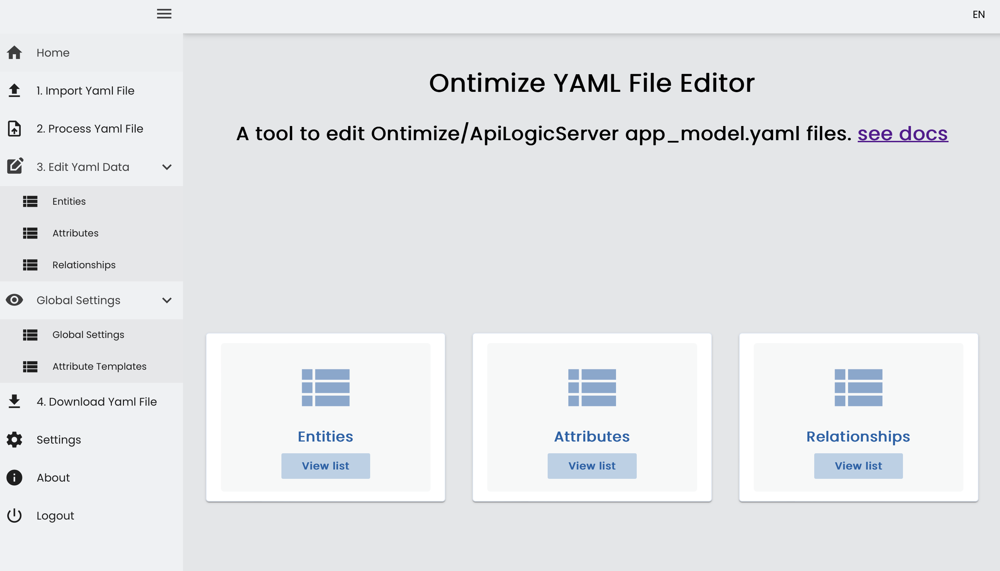
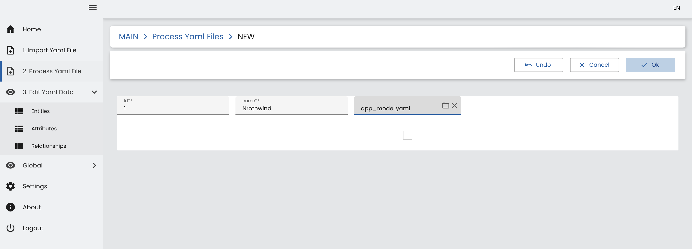
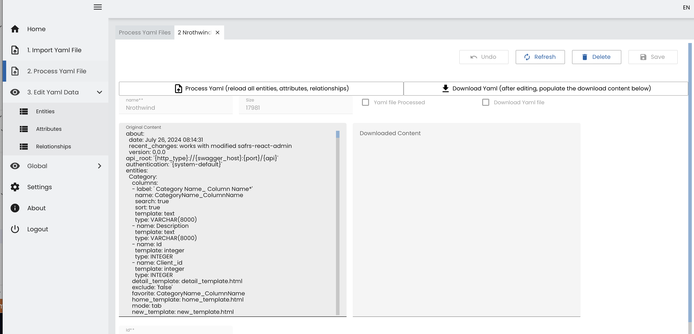
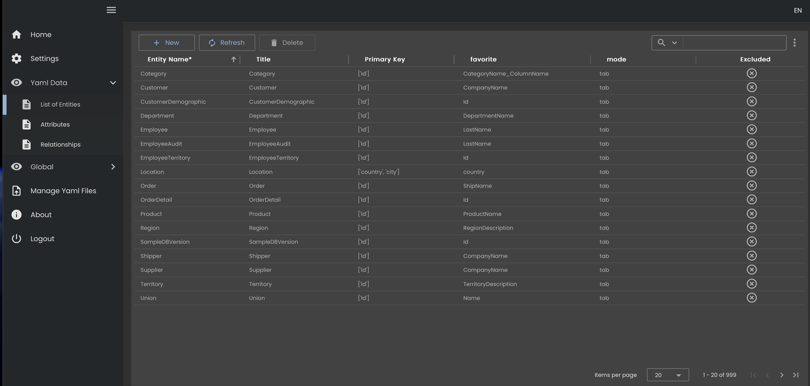
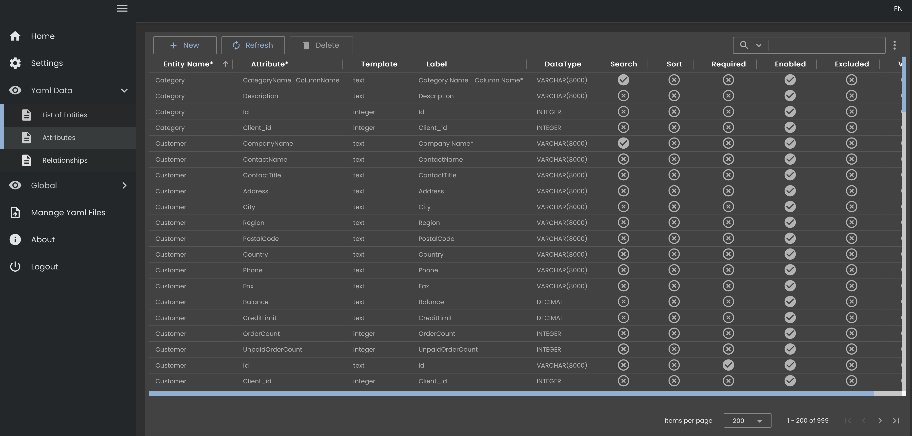

# Ontimize Yaml editor
The YAML editor was built using ApiLogicServer and Ontimize [see docs](https://apilogicserver.github.io/Docs/App-Custom-Ontimize-Overview/) - a local SQLite database is used to store the Ontimize created app_model.yaml files.  The model was created using ApiLogicServer (app-create and app-build) feature to generate the complete application from the yaml file. This editor is designed to help developers edit the yaml attributes, apply column templates and labels used in the Ontimize application generation. Use "Manage Yaml Files" to import your file and the flags to import or download the changes.

## Ontimize Seed
The Ontimize application is loaded in ui/yaml directory. The react-admin is in the ui/admin directory.

## Run the demo

## 1.1 Establish Your Python Environment 
Install Python 3.12 or higher (if you choose the Docker option - skip these steps)

```bash title="Install API Logic Server in a Virtual Environment"
python3 -m venv venv                        # may require python3 -m venv venv
venv\Scripts\activate                       # mac/linux: source venv/bin/activate
pip install ApiLogicServer
```

```bash title="Install the Ontimize Yaml project and launch VSCode"
git clone https://github.com/tylerm007/ontimize_yaml_view.git
cd /ontimize_yaml_view
code .
```

```bash title="start ApiLogicServer"
! REQUIRES INSTALLATION of NodeJS and NPM (Node Package Manager)
-- press F5 to start ApiLogicServer
-- in a terminal window or 
-- use run > menu to Install Ontimize (npm install) and Start Ontimize (npm start)
# cd ontimize_yaml_view/ui/yaml
npm install
npm start
```
```
in a browser:
react-admin backend application
http://localhost:5655 (user: admin password: p)
```

# Run as Docker container

```
docker compose -f devops/docker-compose-dev-local/docker-compose-yaml.yml up -d

in a browser
http://localhost/yaml-editor/ (user: admin password: p)
```
# Run Ontimize from ApiLogicServer
After you install and start the ApiLogicServer (f5) and (cd ui/yaml) npm install and npm start:
```
http://localhost:4298 (user: admin password: p)
```
## 1. Import Yaml File 
The Import will allow you to select an Ontimize/ApiLogicServer app_model.yaml file to upload.  You can import different projects into the editor, but only 1 file can be processed for editing Entities, Attributes, and Relationships. Simply enter the id number, a name, and the app_model.yaml file.



## 2. Process Yaml File 
Go to the "2. Process Yaml Files" then select the app_model.yaml files you wish to process.
Use the Home page and select the row and click []Process Yaml - this will load the yaml file content (entities, attributes, relationships) into the editor (you may need to refresh). Once you have modified your labels, templates, values, you can click on []Download Yaml to populate the download content (or see the ui/app_model_merge.yaml folder).  This file can be merged back into your Ontimize/ApiLogicServer application and then use app-build to create new pages.


## 3. Edit Yaml Data
Once your yaml file has been imported and processed you can now edit Entities, Attributes, and Relationships. This is the same as manually editing the yaml file directly. See the valid field values below for each object.

## Process/Download Yaml
Once you have completed your edits - select Process Yaml Files - select the imported row from the list and click the button 'Download Yaml' it will write to disk and display in the 'downloaded content' window
reflecting all the new edits to your yaml.  Copy this to your app_model.yaml in your project. (you may need to press refresh)



### Download using curl file back to disk (ui/app_model_merge.yaml)
This will write back the modified SQL back to disk as yaml.  Use compare files to merge or replace the merge file for the new ui/app_model_merge.yaml in your application.
```
curl "http://localhost:5655/exportyaml" > app_model_merge.yaml
```
## Entity
Use the Ontimize editor to exclude a selected entity or change the titles.


### Edit Entity
|field|Description|
:------|:---------------|
|Entity name|name of API endpoint {{ entity }}|
|Title|display name used for {{ title }} |
|Primary Key|array of primary keys {{ primaryKeys }}|
|Favorite|used for list-picker display|
|Mode|tab or dialog style {{ editMode }}|
|Menu Group|used to organize entity into menu groups|
|Exclude|if true - skip this API endpoint in the first page generation|

## Attributes
Use the Ontimize editor to change the label, tooltip, exclude selected attributes, include attribute in the search or sort, enable or mark fields as required, and include visible in the home table display.

### Edit Attributes
|field|Description|
:------|:---------------|
|Entity Name|name of api endpoint|
|Attribute|name of API attribute {{ attr }}|
|Title|label used for this attribute {{ label }} |
|Template Name|column template (pick list)|
|Search|is this field included in search|
|Sort|is this field included in sort|
|Required|is this field marked as required|
|Excluded|exclude this attribute from detail/new/home pages|
|Visible|is this attribute visible on home table {{ visibleColumns }}|
|DataType|the internal datatype|
|Tooltip|hover value for attribute|
|Default Value|value to show on new page|

## Relationships (TabGroup)
Use the Ontimize editor to exclude tab on detail page (tomany) or change the tile used to display.

### Edit Tab Groups
|field|Description|
:------|:---------------|
|Entity Name|name of api endpoint|
|Tab Entity|the name of the other end of the relationship|
|Direction|toone (parent) or tomnay (children)|
|Relationship name|defined in SQLAlchemy|
|label|Tab Display name|
|Exclude|skip this relationship for all tabs and lookups|
|Foreign Keys|array of values|

## Global Settings
These values are injected into the various entity and attribute to provide and set global values.  New values can be added for new templates.

### Values
|field|Description|
:------|:---------------|
|Include Translation|set to true and then do an app-build to generate Spanish translation (assets/Ii8n/es.json)|
|Currency Symbol|set for locale $ |

## Attribute Templates
This is a list of defined column templates.  If new templates are created - they can be added here and must be copied to the ui/{ontimize_app_name}/templates directory.

# Quick Start

For **VSCode** Users, you are ready to run:
1. `Press F5 to Run` (your venv is defaulted)  
2. Disable the startup message by renaming `.vscode/tasks.json`

For **other IDEs,** please follow the [Setup and Run](#1-setup-and-run) procedure, below.

> Tip: create the sample app for customization examples: `ApiLogicServer create --project_name=ApiLogicProject --db_url=`

&nbsp;

# Using this readme

This readme contains the following sections:


| Section                  | Info                               |
|:-------------------------|:-----------------------------------|
| [1. Setup and Run](#1-setup-and-run) | Information about API Logic Server, and setting up your venv     |
| [2. Deployment](#2-deployment) | Deploy early previews to the cloud - enable team collaboration     |
| [3. Key Customization Files](#3-key-customization-files) | Quick idea of the key files you'll alter        |
| [4. Project Requirements](#4-project-requirements)     | Options for capturing requirements |
| [5. Project Information](#5-project-information)                | Creation dates, versions          |
| [Appendix - Key Technologies](#appendix-key-technologies)    | Doc links of key libraries         |

&nbsp;

# 1. Setup and Run

To run your project, the system requires various runtime systems for data access, api, and logic.  These are included with API Logic Server ([architecture doc here](https://apilogicserver.github.io/Docs/Architecture-What-Is/)).  

So, to run your project:

*  __1.1 Establish your Python Environment__ 
    * Docker or VSCode - [nothing to do](#docker-or-vscode---nothing-to-do)
    * Otherwise, [Establish Your Python Environment](#establish-your-python-environment---other-environments) to activate these runtime systems
* __[1.2 Run](#12-run)__

&nbsp;

## 1.1 Establish Your Python Environment - Other Environments

Your `requirements.txt` has already been created, so...

```bash title="Install API Logic Server in a Virtual Environment"
python -m venv venv                        # may require python3 -m venv venv
venv\Scripts\activate                      # mac/linux: source venv/bin/activate
python -m pip install -r requirements.txt  # accept "new Virtual environment"
```

Notes:

* See also the `venv_setup` directory in this API Logic Project.

* If using SqlServer, install `pyodbc`.  Not required for docker-based projects.  For local installs, see the [Quick Start](https://apilogicserver.github.io/Docs/Install-pyodbc/).

&nbsp;

#### Docker or VSCode - nothing to do

Nothing to do here:

* **VSCode:** projects automatically use installed API Logic Server `venv`, so this step is ***not required*** until you want to create a local `venv` for additional packages.

* **Docker:** Your runtime systems are part of Dev Container, which you probably activated when you [opened the project](https://apilogicserver.github.io/Docs/IDE-Execute/).  

    * If you did not accept the "Open in Container" option when you started VSCode, use __View > Command Palette > Remote-Containers: Reopen in Container__.

&nbsp;

&nbsp;

## 1.2 Run

The `ApiLogicServer create` command creates Run Configurations for PyCharm and VSCode:

* For PyCharm, press Ctl-D
* For VSCode, &nbsp;press F5:


As shown above:

1. Use the pre-supplied Run Configurations; use either...
    * `ApiLogicServer` to run [with security](https://apilogicserver.github.io/Docs/Security-Swagger/)
    * `ApiLogicServer - No Security` (simplifies use of Swagger)
2. Click the url in the console to start the Admin App
    * Use it to explore your **data** (shown below)
    * And your **API** (via Swagger)


&nbsp;

# 2. Deployment

The `devops` directory contains several scripts for creating container images, testing them, and deploying them.

Since API Logic Server creates working software (UI, API), you can do this after creating your project, to [collaborate with your team](https://apilogicserver.github.io/Docs/DevOps-Containers-Preview/).

&nbsp;

# 3. Key Customization Files

Your project is ready to run, but it's likely you'll want to customize it - declare logic, new endpoints, etc.

>> Tip: in particular, use the sample app to explore the value of ___declarative logic and security.___  Unique to API Logic Server, this is critical to unlocking the full value of API Logic Server.

The ___Key Customization Files___ listed in the table below are created as stubs, intended for you to add customizations that extend the created API, Logic and Web App.

* Since they are separate files, the project can be
[rebuilt](https://apilogicserver.github.io/Docs/Project-Rebuild/) (e.g., synchronized with a revised schema), preserving your customizations.

To explore customization, see the `nw` sample for examples of typical customizations.  You can open it in GitHub (use Shift + "." to view in project mode) - [click here](https://github.com/ApiLogicServer/demo), or create it locally (`ApiLogicServer create` - accept defaults).

To make customizations easy to explore, **search for:**
* `#als` will reveal key customization examples
* `Your Code Goes Here` to find key files to customize, summarized below:

| Directory | Usage                         | Key Customization File             | Typical Customization                                                                 |
|:-------------- |:------------------------------|:-----------------------------------|:--------------------------------------------------------------------------------------|
| ```api``` | **JSON:API**<br>*Ready to Run*                    | ```api/customize_api.py```         | Add new end points / services                                                         |
| ```ui``` | **Multi-Page Admin App**<br>*Ready to Run*  | ```ui/admin/admin.yaml```          | Control field display - order, captions etc.    
| ```ui/yaml``` | **Multi-Page Ontimize App**<br>*Ready to Run*  | ```ui/yaml/app_model.yaml```          | Control field display - order, captions etc.                                         |
| ```database``` | SQLAlchemy Data Model Classes | ```database/customize_models.py``` | Add derived attributes, and relationships missing in the schema                       |
| ```logic``` | **Transactional Logic**<br>spreadsheet-like rules   | ```logic/declare_logic.py```       | Declare multi-table derivations, constraints, and Python events such as send mail / messages |
| ```security``` | Authentication, Authorization   | ```security/declare_security.py```          | Control login, role-based row access         |
| ```integration``` | Consume Kafka Messages             | ```integration/kafka/kafka_consumer.py```          |  [Application Integration](https://apilogicserver.github.io/Docs/Sample-Integration/)                                          |
| ```tests``` | Behave Test Suite              | ```tests/api_logic_server_behave/features```          | Declare and implement [Behave Tests](https://apilogicserver.github.io/Docs/Behave/)                                          |

> Note: API Logic Server CLI provides commands you can use to ugrade your project, e.g., to add security.  Discover the CLI commands with `ApiLogicServer`.

&nbsp;

# 4. Project Requirements

Optionally, you can **document requirements** as part of an **executable test plan**.  Test plan execution creates documentation (in markdown), including **requirements traceability** into implementation.  [See example here](test/api_logic_server_behave/reports/Behave%20Logic%20Report%20Sample.md).

&nbsp;

# 5. Project Information

This API Logic Project was created with the `ApiLogicServer create` command.
For information on Managing API Logic Projects, [click here](https://apilogicserver.github.io/Docs/Project-Structure).

| About                    | Info                               |
|:-------------------------|:-----------------------------------|
| Created                  | April 26, 2024 11:18:59                      |
| API Logic Server Version | 10.03.84           |
| Created in directory     | ontimize |
| API Name                 | api          |
| Execution begins with    | `api_logic_server_run.py`          |


&nbsp;

# Appendix: Key Technologies

API Logic Server is based on the projects shown below.
Consult their documentation for important information.

&nbsp;

### SARFS JSON:API Server

[SAFRS: Python OpenAPI & JSON:API Framework](https://github.com/thomaxxl/safrs)

SAFRS is an acronym for SqlAlchemy Flask-Restful Swagger.
The purpose of this framework is to help python developers create
a self-documenting JSON API for sqlalchemy database objects and relationships.

These objects are serialized to JSON and 
created, retrieved, updated and deleted through the JSON API.
Optionally, custom resource object methods can be exposed and invoked using JSON.

Class and method descriptions and examples can be provided
in yaml syntax in the code comments.

The description is parsed and shown in the swagger web interface.
The result is an easy-to-use
swagger/OpenAPI and JSON:API compliant API implementation.

&nbsp;

### LogicBank
[Transaction Logic for SQLAlchemy Object Models](https://apilogicserver.github.io/Docs/Logic-Why/)

Use Logic Bank to govern SQLAlchemy update transaction logic - 
multi-table derivations, constraints, and actions such as sending mail or messages. Logic consists of _both:_

*   **Rules - 40X** more concise using a spreadsheet-like paradigm, and

*   **Python - control and extensibility,** using standard tools and techniques

Logic Bank is based on SQLAlchemy - it handles `before_flush` events to enforce your logic.
Your logic therefore applies to any SQLAlchemy-based access - JSON:Api, Admin App, etc.

&nbsp;

### SQLAlchemy

[Object Relational Mapping for Python](https://docs.sqlalchemy.org/en/13/).

SQLAlchemy provides Python-friendly database access for Python.

It is used by JSON:Api, Logic Bank, and the Admin App.

SQLAlchemy processing is based on Python `model` classes,
created automatically by API Logic Server from your database,
and saved in the `database` directory.

&nbsp;

### Admin App

This generated project also contains a React Admin app:
* Multi-page - including page transitions to "drill down"
* Multi-table - master / details (with tab sheets)
* Intelligent layout - favorite fields first, predictive joins, etc
* Logic Aware - updates are monitored by business logic

&nbsp;

### Python Tips

If you are new to Python, check out [these tips](https://apilogicserver.github.io/Docs/Tech-Python/).